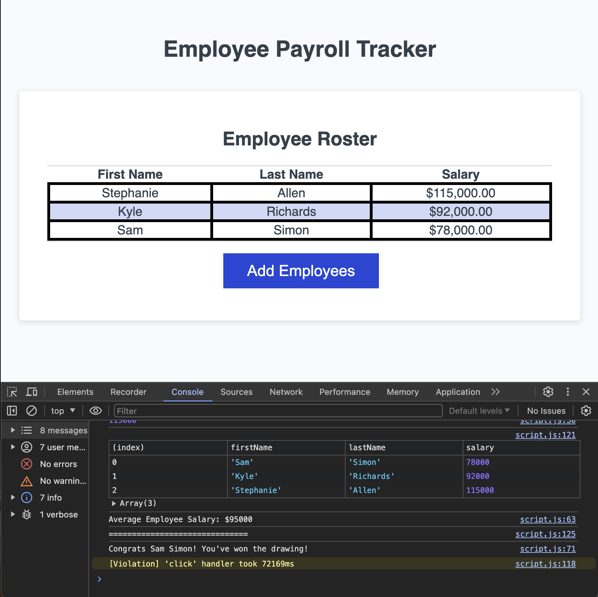

# week-three-challenge-karenas
Javascript Challenge 
The goal of this project was to create an employee payroll tracker for an end user client using javascript.

The payroll tracker includes an array of employees created by prompting the user to input employee data including First Name Last Name and Salary. Each employee is pushed into the employeeArray with employee.push. When the user is done adding employees the table of employees populates with employee data. The payroll tracker also includes a while loop that allows the user to add as many employees as they like, so long as they continue to confirm that they would like to add another employee.

An alert displays when salary entered in salary prompt is not a number using isNaN.

The average salary is displayed in the console.log using a for loop to calculate the total salary and then divided the total salary by the length of the employeeArray.

A random employee winner is selected via a math.floor and math.random function.

Sample tracker: 

!

https://katherinearenas.github.io/week-three-challenge-karenas/

